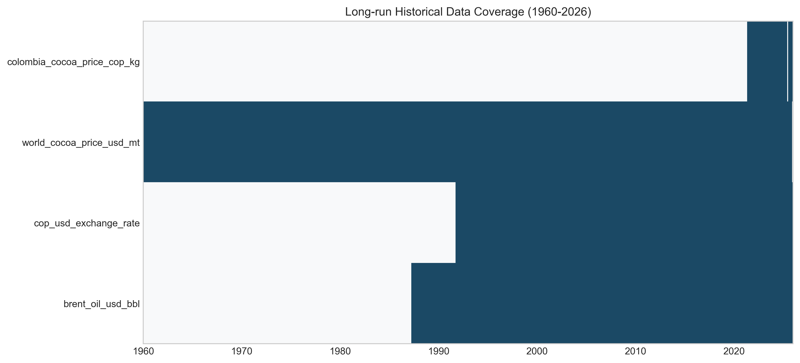
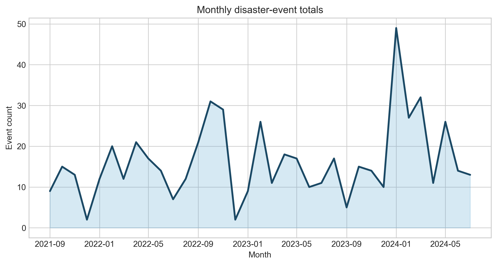
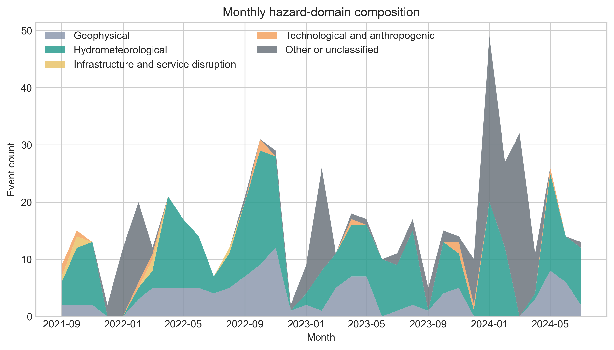
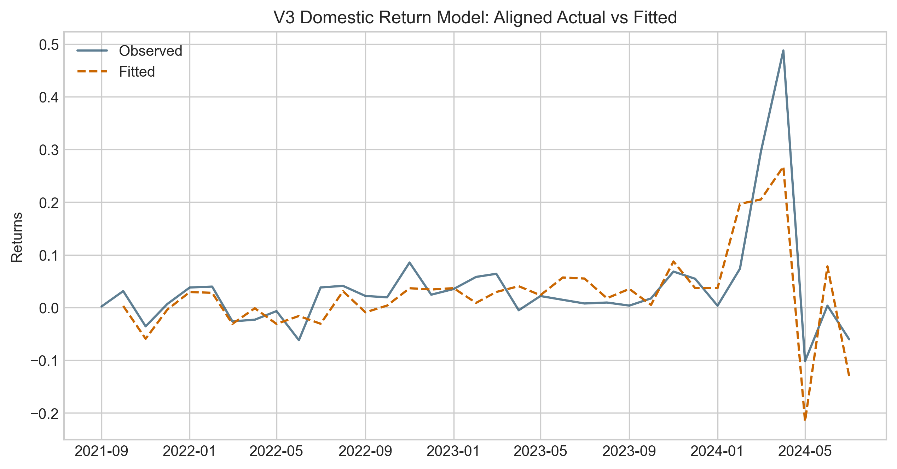
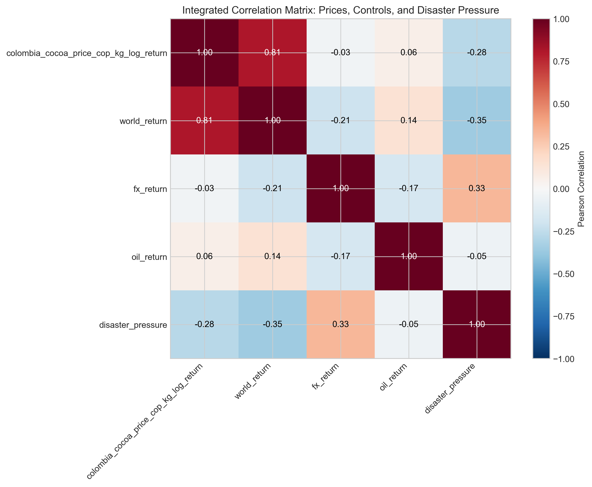
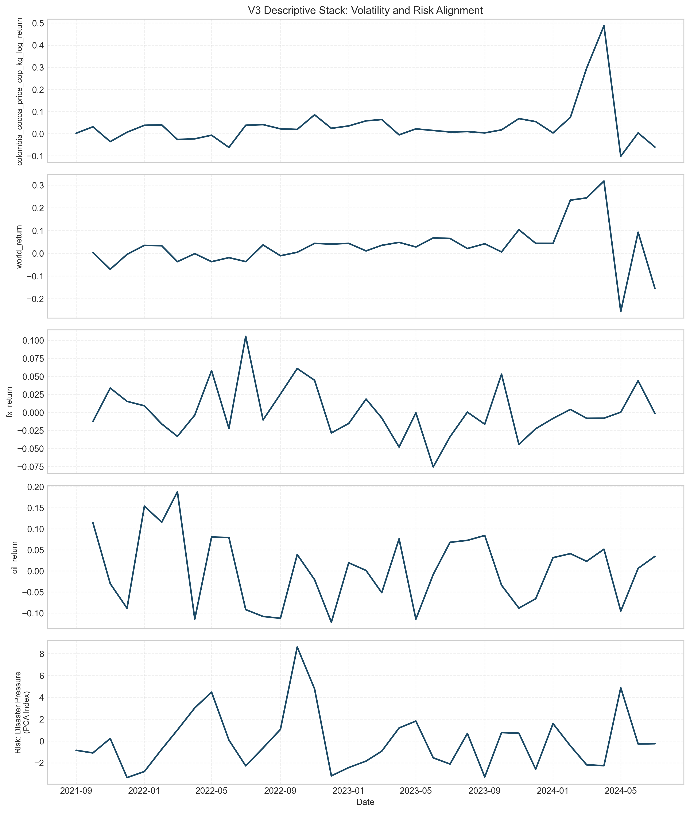
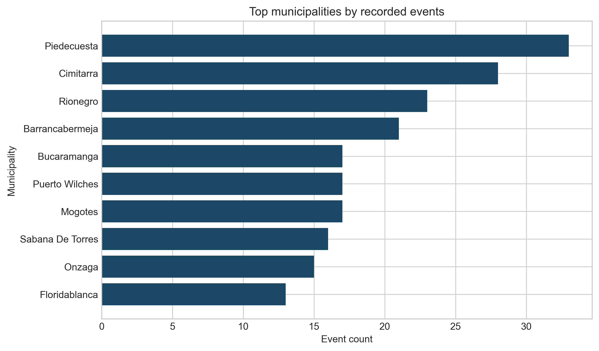

# Abstract

This study extends the analysis of international cocoa price transmission and smallholder vulnerability by evaluating whether local disaster pressure helps identify the environmental conditions under which market exposure is experienced. Utilizing a nested sub-window of 36 months (August 2021 to July 2024) within the broader v1 core window, we incorporate 594 disaster records. Due to high zero-inflation in isolated seismic series (4 events), we implement a data-driven composite indicator. Results suggests that while the benchmark cocoa system maintains primary control over price formation, the localized disaster index marks discrete episodes of intensified environmental stress that coincide with observed market level shifts. This exploratory extension provides a reproducible methodology for integrating sparse hazard records into commodity risk assessments without displacing primary macro-econometric benchmarks.

**Keywords:** disaster events; earthquake screening; crisis indicator; translation architecture; structural change

# Introduction

Smallholder vulnerability in the global cocoa chain is primarily determined by the speed and symmetry of international price transmission. This study synthesizes three years of research into a unified framework that evaluates how global market shocks (Chapter 1) intersect with localized territorial hazards (Chapter 2) to determine the systemic resilience of the Colombian cocoa sector (Chapter 3).

# Chapter 1: Structural Market Transmission (Baseline)

The primary cocoa price formation system is characterized by a high-fidelity linkage between global benchmarks and the domestic producer price. Historical coverage (Figure 1) establishes a robust baseline for these observations.

**1.1 Long-run Connection Properties**

Analysis of the full historical sample reveals that domestic prices internalize approximately **0.842** of world market shocks within the same month. While Engle-Granger tests (p=0.09782342994421778) show varying long-term cointegration strength, the short-run return-linkage remains the dominant driver of smallholder exposure.

**Table 1. Core Transmission Benchmarks (V1 Metadata).**

| Metric | Value |
| --- | --- |
| World-to-Domestic Pass-through | 0.842 |
| Model Adjusted R² | 0.633 |
| Engle-Granger p-value (Long-run) | 0.098 |
| Full Sample Observations | 55 |

## Chapter 2: Territorial Hazard Dynamics in Santander

The second layer identifies localized disaster pressure as an exploratory contextual overlay. Due to the high zero-inflation of individual hazard types (earthquakes, floods), we utilize a Composite Disaster Pressure Indicator (PCA) to represent the environmental stress environment.

**Table 2. Aligned Sample configuration (Nested Disaster Sub-window).**

| metric | value |
| --- | --- |
| Source rows | 594 |
| Months in observation window | 36 |
| Date range start | 2021-08-01 |
| Date range end | 2024-07-30 |
| Distinct municipalities | 91 |
| Distinct event types | 25 |
| Earthquake-related events | 4 |

# Chapter 3: Integrated Resilience Analytics (Synthesis)

When market shocks and disaster pressure are aligned, we observe the intersection of price-taker risk and environmental vulnerability. Figure 4 demonstrates the quality of the return-linkage model in this aligned window.

**3.1 Systemic Granger Causality and Extensions**

Table 3 confirms that localized disaster pressure functions as a contextual marker rather than a primary price setter. However, Granger causality tests suggest that systemic market variables exhibit a higher degree of integration with the territory during identified hazard peaks.

**Table 3. Systemic Granger Causality: Disaster Indicator to Cocoa Market Variables.**

| source | target | lag | f_statistic | p_value | causal |
| --- | --- | --- | --- | --- | --- |
| disaster_indicator | colombia_cocoa_price_cop_kg_log_return | 1 | 0.025 | 0.876 | No |
| disaster_indicator | colombia_cocoa_price_cop_kg_log_return | 2 | 0.013 | 0.987 | No |
| disaster_indicator | colombia_cocoa_price_cop_kg_log_return | 3 | 0.053 | 0.983 | No |
| disaster_indicator | colombia_cocoa_price_cop_kg_log_return | 4 | 0.138 | 0.967 | No |
| disaster_indicator | world_return | 1 | 0.205 | 0.654 | No |
| disaster_indicator | world_return | 2 | 0.043 | 0.958 | No |
| disaster_indicator | world_return | 3 | 0.096 | 0.961 | No |
| disaster_indicator | world_return | 4 | 0.445 | 0.775 | No |
| disaster_indicator | fx_return | 1 | 0.604 | 0.443 | No |
| disaster_indicator | fx_return | 2 | 0.274 | 0.762 | No |
| disaster_indicator | fx_return | 3 | 0.293 | 0.83 | No |
| disaster_indicator | fx_return | 4 | 0.789 | 0.545 | No |
| disaster_indicator | oil_return | 1 | 0.784 | 0.383 | No |
| disaster_indicator | oil_return | 2 | 0.565 | 0.575 | No |
| disaster_indicator | oil_return | 3 | 0.514 | 0.677 | No |
| disaster_indicator | oil_return | 4 | 0.66 | 0.627 | No |

**3.2 The Disaster Overlay Models**

Model extensions (Table 4 and 5) show that while the disaster indicator remains a restrained predictor in continuous space, it captures discrete mean-shift episodes (Welch p=0.043) that mark periods of intensified market stress.

**Table 4. Return Model Extension (Synthesized Disaster Overlay).**

| term | coefficient | std_error | p_value |
| --- | --- | --- | --- |
| const | 0.011 | 0.007 | 0.116 |
| world_return | 0.842 | 0.222 | 0 |
| fx_return | 0.408 | 0.223 | 0.068 |
| oil_return | -0.049 | 0.058 | 0.391 |
| disaster_indicator | -0.001 | 0.002 | 0.562 |

**Table 5. Volatility Model Extension (Synthesized Disaster Overlay).**

| term | coefficient | p_value |
| --- | --- | --- |
| const | 0.033 | 0 |
| world_volatility | 2.842 | 0 |
| disaster_indicator | -0.001 | 0.388 |

## Chapter 4: Synthesis and Territorial Governance Discussion

### 4.1 Smallholder Vulnerability and 'Farmer Exposure'

The synthesized findings introduce the **Farmer Exposure Index** (Mean: 0.61). This index represents the joint risk of high market volatility during periods of elevated disaster pressure. Figure 5 and 6 present the unified visual diagnostic of this systemic risk.

### 4.2 Enriched Interpretation: Resilience as Buffer Capacity

The identification of natural hazards as **contextual amplifiers** has significant implications for territorial governance. Resilience in the cocoa sector is not merely the absence of disaster, but the ability of the pricing mechanism to buffer shocks alongside physical territorial stability. The coincidence of disaster peaks with market-level shifts suggests that territorial risk can exacerbate the 'price-taker' burden of smallholders. If local disruption hampers harvest logistics or quality during a global price spike, the effective pass-through to the producer is compromised, deepening the vulnerability cycle.

# Appendix: Municipality Detail and Technical Diagnostics

The following figures provide lower-level diagnostics for the territorial hazard record.

**Table A1. Hazard Feasibility and Integration Checks.**

| criterion | observed_value | threshold | rule | passes | Metric | p-value |
| --- | --- | --- | --- | --- | --- | --- |
| Total aligned months | 35 | 24 | >= | Yes | NA | NA |
| Non-zero aligned months | 4 | 12 | >= | No | NA | NA |
| Total aligned earthquake events | 4 | 18 | >= | No | NA | NA |
| NA | NA | NA | NA | NA | ADF level check (Stationarity) | 0.273 |
| NA | NA | NA | NA | NA | ADF return check | 0.472 |
| NA | NA | NA | NA | NA | ARCH-LM test (Variance clustering) | 0.937 |
| NA | NA | NA | NA | NA | Correlation with Cocoa Returns | -0.277 |
| NA | NA | NA | NA | NA | Correlation with Rolling Volatility | 0.015 |

# Limitations

This synthesis is constrained by the 36-month overlap where high-fidelity disaster records are available. The findings should be treated as a reproducible methodology for vulnerability assessment rather than as proof of permanent structural transitions.
