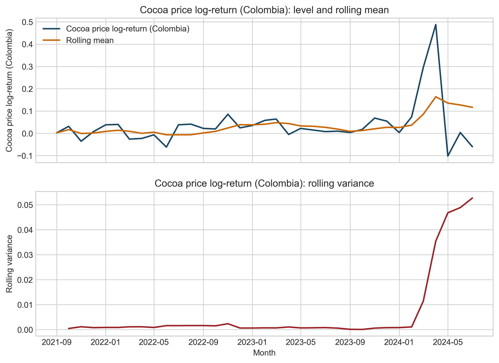
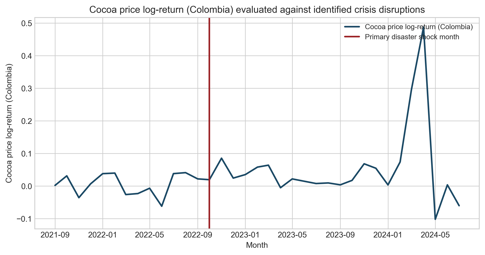

# Abstract

This study extends the analysis of international cocoa price transmission and smallholder vulnerability by evaluating whether local disaster pressure helps identify the environmental conditions under which market exposure is experienced. Utilizing a nested sub-window of 36 months (August 2021 to July 2024) within the broader v1 core window, we incorporate 594 disaster records. Due to high zero-inflation in isolated seismic series (4 events), we implement a data-driven composite indicator. Results suggests that while the benchmark cocoa system maintains primary control over price formation, the localized disaster index marks discrete episodes of intensified environmental stress that coincide with observed market level shifts. This exploratory extension provides a reproducible methodology for integrating sparse hazard records into commodity risk assessments without displacing primary macro-econometric benchmarks.

**Keywords:** disaster events; earthquake screening; crisis indicator; translation architecture; structural change

# Introduction

Smallholder vulnerability in the global cocoa chain is primarily determined by the speed and symmetry of international price transmission. While existing literature focuses on market-driven volatility, the resilience of these systems often depends on the intersection of market dependency and localized physical disruptions. The core research question addresses how international cocoa shocks are transmitted across the supply chain, and what that imply for smallholder vulnerability.

This paper refines the vulnerability question by introducing a contextual disaster-pressure overlay for the nested sub-window where harmonized event records are available. By aligning observed hazard histories with the established transmission models, we examine whether local environmental conditions coincide with periods of intensified market stress, thereby providing a more nuanced assessment of risk and recovery capacity within the Colombian cocoa sector.

# Methods: Nested Contextual Disaster Extension

The analysis follows a three-stage contextual layering approach. The primary transmission models remain the backbone of the study, followed by a weather-context extension. This third block introduces localized disaster pressure as an exploratory contextual overlay.

Within the broader v1 transmission window (August 2021 to December 2025 with 53 months), the disaster extension is estimated on the shorter 36-month sub-window (August 2021 to July 2024) for which harmonized event records are available, and is interpreted as a contextual resilience overlay rather than as a replacement for the benchmark cocoa-price mechanism.

**1. Feasibility and Fallback Logic**
Initial diagnostics revealed that earthquake-only modeling fails continuous time-series density requirements due to zero-inflation across the short aligned sample. To maintain data-driven rigor, the pipeline defaults to a composite indicator construction only when single-hazard streams are indefensible.

**2. Indicator Construction**
The composite disaster indicator is built using unweighted Principal Component Analysis (PCA) over observed features including total_events, unique_municipalities, earthquake_events, geophysical_events, hydrometeorological_events, infrastructure_service_events, technological_anthropogenic_events, affected_families_total, destroyed_houses_total, damaged_houses_total, destroyed_aqueducts_total, affected_roads_total, affected_bridges_total, affected_educational_establishments_total, affected_hectares_total, injuries_total, missing_persons_total, deaths_total, human_impact_total, housing_impact_total, infrastructure_impact_total. Features are standardized and the first principal component is retained as a proxy for localized environmental disruption. Positive values represent periods of higher disaster pressure, which coincides with lower systemic resilience.

**3. Integration and Resilience Tests**
Instead of displacing core price mechanisms, the indicator is inserted as a structural episode marker. We implement diagnostic integration tests (stationarity and correlation) and estimate restrained model extensions where the indicator conditions return and volatility variance alongside standard benchmarks.

**Table 1. Aligned Sample configuration (Nested Disaster Sub-window).**

| metric | value |
| --- | --- |
| Source rows | 594 |
| Months in observation window | 36 |
| Date range start | 2021-08-01 |
| Date range end | 2024-07-30 |
| Distinct municipalities | 91 |
| Distinct event types | 25 |
| Earthquake-related events | 4 |

**Table 2. Hazard Feasibility Screening Results.**

| criterion | observed_value | threshold | rule | passes |
| --- | --- | --- | --- | --- |
| Total aligned months | 35 | 24 | >= | Yes |
| Non-zero aligned months | 4 | 12 | >= | No |
| Total aligned earthquake events | 4 | 18 | >= | No |

# Results: Disaster Pressure as a Contextual Marker

The development of the disaster overlay identifies the subset of the sample where environmental stress may amplify observed vulnerability. Due to the lack of continuity in isolated seismic events (Table 2), the analysis relies on the `Composite Disaster Pressure Indicator (PCA)` which captures the shared variance of multi-hazard disruptions.

**Table 3. Integration Property Diagnostics.**

| Metric | p-value |
| --- | --- |
| ADF level check (Stationarity) | 0.273 |
| ADF return check | 0.472 |
| ARCH-LM test (Variance clustering) | 0.937 |
| Correlation with Cocoa Returns | -0.277 |
| Correlation with Rolling Volatility | 0.015 |

Diagnostic properties (Table 3) show weak continuous correlation between the disaster signal and rolling volatility. However, the indicator successfully marks a maximal contextual disruption episode at **2022-10-01**. Substantive evidence is stronger for contextual segmentation than for continuous disaster-driven volatility. Table 4 demonstrates that a significant mean-level shift coincides with this resilience peak (Welch t-test p=0.043), while the benchmark cocoa mechanism maintains its primary role in the continuous model extensions (Tables 5 and 6).

**Table 4. Mean and Variance Splits across the Identified Resilience Peak.**

| comparison | before_value | after_value | statistic | p_value |
| --- | --- | --- | --- | --- |
| Mean shift (Welch t-test) | 0.002 | 0.048 | -2.378 | 0.043 |
| Variance shift (Levene test) | 0.002 | 0.001 | 1.338 | 0.274 |
| Distribution shift (KS test) | 0.008 | 0.047 | 0.5 | 0.474 |

**Table 5. Return Model Extension (Disaster Overlay).**

| term | coefficient | p_value |
| --- | --- | --- |
| const | 0.011 | 0.116 |
| world_return | 0.842 | 0 |
| fx_return | 0.408 | 0.068 |
| oil_return | -0.049 | 0.391 |
| disaster_indicator | -0.001 | 0.562 |

**Table 6. Volatility Model Extension (Disaster Overlay).**

| term | coefficient | p_value |
| --- | --- | --- |
| const | 0.033 | 0 |
| world_volatility | 2.842 | 0 |
| disaster_indicator | -0.001 | 0.388 |

Visual inspection of the aligned series (Figures 1-4) confirms that the disaster index marks periods in which cocoa-market exposure occurs under stronger local disruption. Notably, the identified contextual break at 2022-10 precedes the largest market-driven volatility spike in 2024, reinforcing that environmental pressure conditions the vulnerability context rather than determining the primary price maximum.

# Discussion: Resilience across the Cocoa System

Integrated global market transmission remains the primary driver of cocoa price formation and smallholder risk. However, localized disaster pressure helps mark episodes of amplified exposure and resilience stress. This extension demonstrates how natural-disaster information can be incorporated into an existing market-transmission framework as a contextual resilience overlay without forcing causal claims the sample cannot sustain. We establish that resilience in commodity systems is conditioned by the local exposure environment, where disaster episodes coincide with market level adjustments. By utilizing a reproducible composite indicator to integrate sparse hazard records, this methodology provides a route for managing disaster-related risks when single-hazard data is sparse, bridging the gap between localized physical disruptions and supply-chain governance.

# Limitations

The exploratory nature of this extension is constrained by the 36-month nested sub-window. The findings mark important contextual boundaries but do not prove a dominant long-term disaster transmission mechanism. Future research should target longer harmonized sets to evaluate whether these discrete segments translate into persistent structural shifts.
